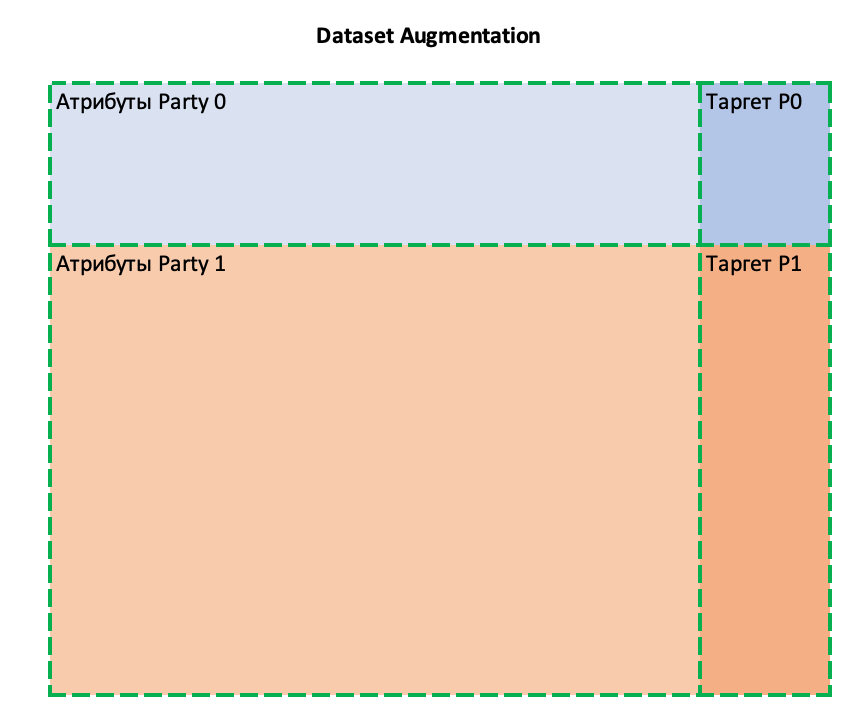

# Домашнее задание
Используя CrypTen обучить линейную регрессию для сценария Data Augmentation - у каждой из двух сторон есть данные и таргет. 

Стороны хотят обучить модель на объединенном датасете без прямой передачи друг другу своих данных.

Использовать TrustedThirdParty (TTP) для генерации троек Бивера.

Метрики итоговой модели проверять на (X_test, y_test), которые есть у worker1.

